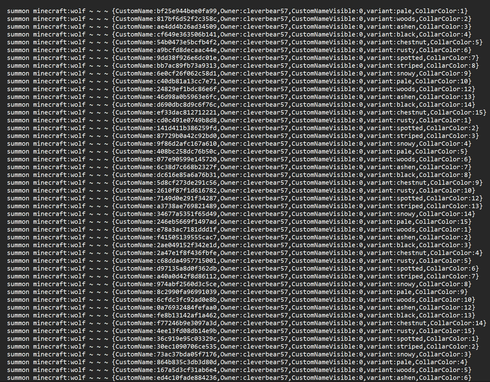
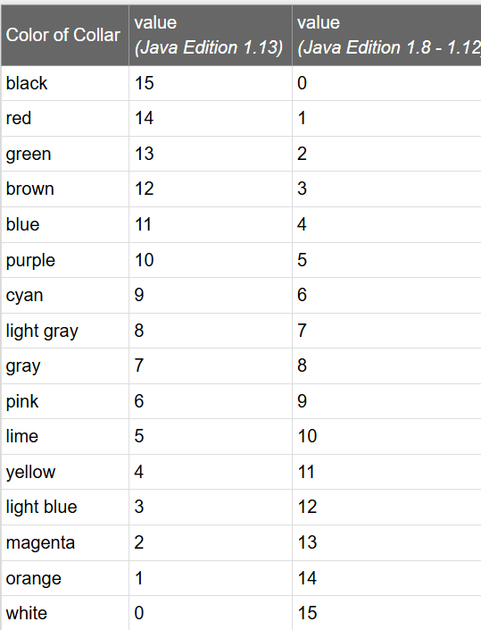
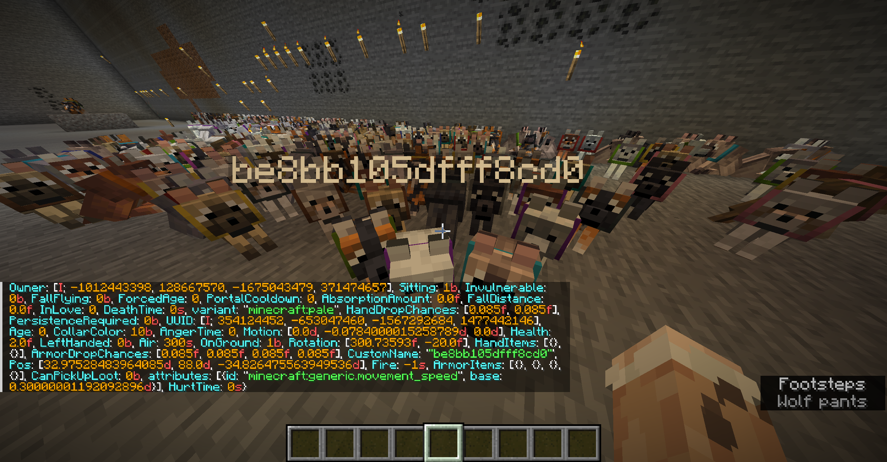
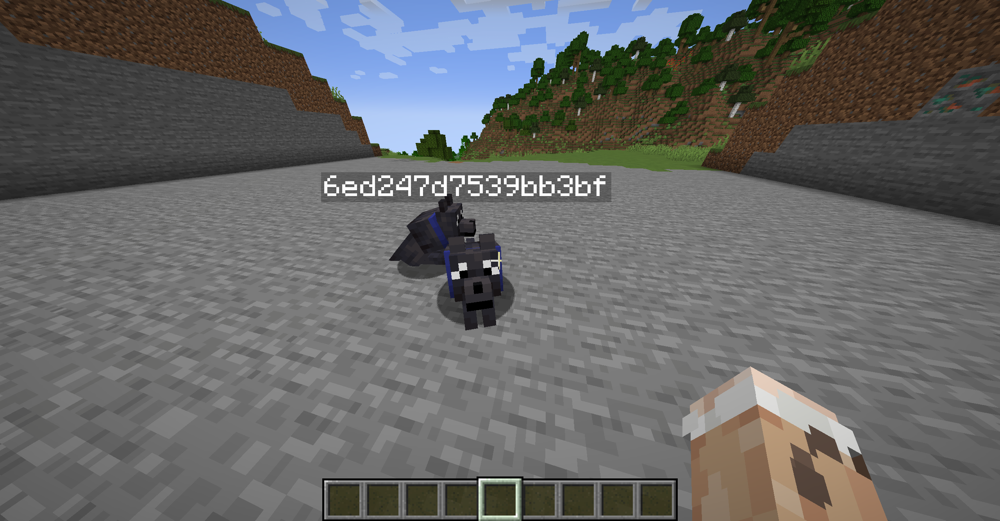

# Forensics/playful-puppy

## Decription

I lost my dog in Minecraft. Can you find him? The name of the dog wrapped in `ictf{}` is the flag.

The dog's name is 16 hex characters, anything else is not correct.

### Attachments: 

## **Challenge Overview** 

In the challenge we were given a minecraft world and a iamge(to be used later) where a lot of tames wolf were spawned.
So my first step was to look into the world folder where in datapacks, i found the nested folders and in last i found `dog.mcfunction` .
This file contains commands to summon tamed with customname,variant,collarcolor etc.

All the dogs had name with 16 hex characters so my next step goes to the image provided.
The image was of a black dog(referring to wolf variant) and that dog has a blue collar.
Then i googled for java edition collarcolor code and found this

Since it world has Java Edition 1.21 we will follow JE 1.13 collarcolor value i.e. 11 for blue.
Then i open minecraft world and checked the data entry a random wolf.

This gives me the format to teleport all the wolf with certain a NBT.
Then using this command
`/tp @e[type=minecraft:wolf,nbt={variant:"minecraft:black",CollarColor:11b}] ~ ~ ~` 
I teleported all wolf with variant:black and collar color:blue(11b)

Now i just have these two dogs and lucky for me that my first try was successful.
Flag-->`ictf{6ed247d7539bb3bf}`