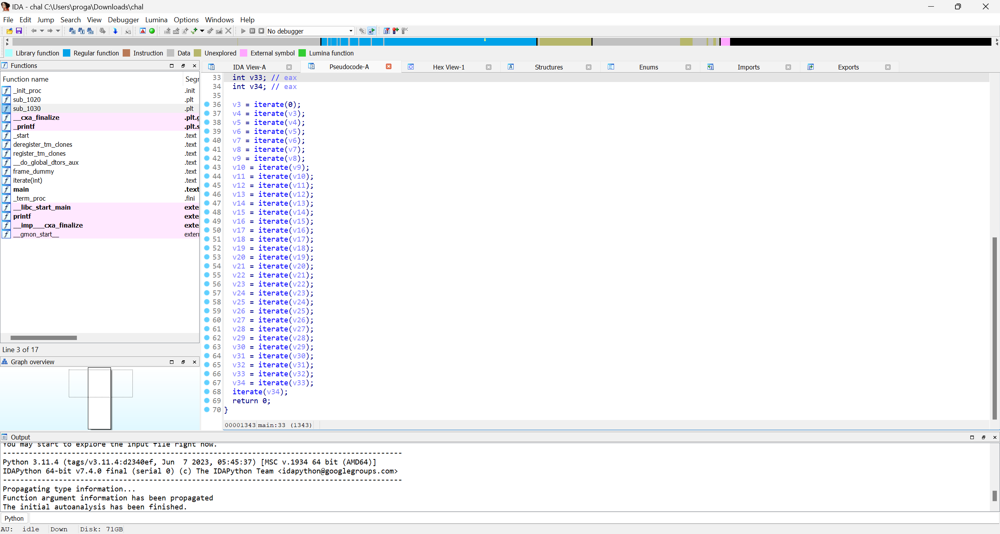
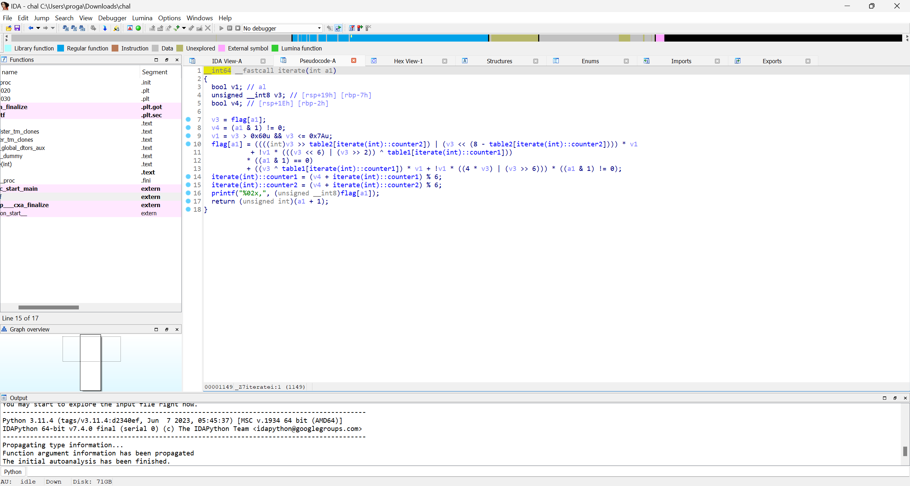

# REV/unconditional

## Description
Can you reverse this flag mangler? The output is `b4,31,8e,02,af,1c,5d,23,98,7d,a3,1e,b0,3c,b3,c4,a6,06,58,28,19,7d,a3,c0,85,31,68,0a,bc,03,5d,3d,0b`

The input only contains lowercase letters, numbers, underscore, and braces .

### Attachments: [chal](chal)

## Challenge Overview

In the challenge we were given a elf file that has a `flag` variable with value `nothing_here_lmao`.
In the main function there was a repeating calling of iterate funciton using previous value giving a hint about for loop.

In the iterate function i found that return value is actually `iterator+1` i.e. this is a loop of 33 characters and that is the length of our flag.
Each character is being bitwise manipulated and then its last two characters are printed in hex.

Here is the code for the program
 
  chal.cpp
```cpp
#include <iostream>
using namespace std;
int main()
{
    string flag = "nothing_here_lmao";
    int table1[] = {82, 100, 113, 81, 84, 118};
    int table2[] = {1, 3, 4, 2, 6, 5};
    int counter1 = 0, counter2 = 0;
    for (int i = 0; i < flag.size(); i++)
    {
        char v3 = flag[i];
        bool v1, v4;
        v4 = (i & 1 != 0);
        v1 = v3 > 0x60 && v3 <= 'z';
        flag[i] = ((((int)v3 >> table2[counter2]) | (v3 << (8 - table2[counter2]))) * v1 + !v1 * (((v3 << 6) | (v3 >> 2)) ^ table1[counter1])) * ((i & 1) == 0) + ((v3 ^ table1[counter1]) * v1 + !v1 * ((4 * v3) | (v3 >> 6))) * ((i & 1) != 0);
        counter1 = (v4 + counter1) % 6;
        counter2 = (v4 + counter2) % 6;
        printf("%02x,", (uint8_t) int(flag[i]));
    }
    return 0;
}
```
### Exploit
This a lazy approach but the simples way is bruteforcing as it checks character by character.

exploit.cpp
```cpp
#include <iostream>

using namespace std;

int main()
{
    int ans[]={0xb4,0x31,0x8e,0x02,0xaf,0x1c,0x5d,0x23,0x98,0x7d,0xa3,0x1e,0xb0,0x3c,0xb3,0xc4,0xa6,0x06,0x58,0x28,0x19,0x7d,0xa3,0xc0,0x85,0x31,0x68,0x0a,0xbc,0x03,0x5d,0x3d,0x0b};
    string flag1 = "1234567890_{}abcdefghijklmnopqrstuvwxyz";
    string flag = "aaaaaaaaaaaaaaaaaaaaaaaaaaaaaaaaa";
    // char a;
    int b=0;
    string f="";
    int table1[] = {82, 100, 113, 81, 84, 118};
    int table2[] = {1, 3, 4, 2, 6, 5};
    int counter1 = 0, counter2 = 0;
    for (int i = 0; i < 33; i++)
    {   
        char v3 = flag[i];
        bool v1, v4;
        f+=flag[i];
        v4 = (i & 1 != 0);
        v1 = v3 > 0x60 && v3 <= 'z';
        flag[i] = ((((int)v3 >> table2[counter2]) | (v3 << (8 - table2[counter2]))) * v1
            + !v1 * (((v3 << 6) | (v3 >> 2)) ^ table1[counter1]))
           * ((i & 1) == 0)
           + ((v3 ^ table1[counter1]) * v1 + !v1 * ((4 * v3) | (v3 >> 6))) * ((i & 1) != 0);
        if(flag[i]!=char(ans[i])){
            flag[i]=flag1[(++b)%flag1.length()];
            f.pop_back();
            i--;}
        else{
        b=0;
        counter2=(v4+counter2)%6;
        counter1=(v4+counter1)%6;
        }
        cout<<(f)<<endl;
    }
    return 0;
}
```
Flag-->`ictf{m0r3_than_1_way5_t0_c0n7r0l}`

